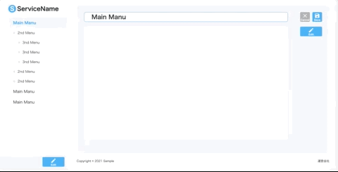

## Description

NCDC フロント課題[Markdown Editor]のバックエンドリポジトリ


## Installation & exec

```bash
# install
$ yarn install
# migration
$ yarn migration:run
# start build
$ yarn build
# 実行
$ yarn start
```

## API

API の Document は、  
アプリを起動後、`http://localhost:3000/api` にて Swagger で確認できる。  


## DB を初期状態に戻す

```bash
$ cp ./data/bk-dev.sqlite ./data/dev.sqlite
```
